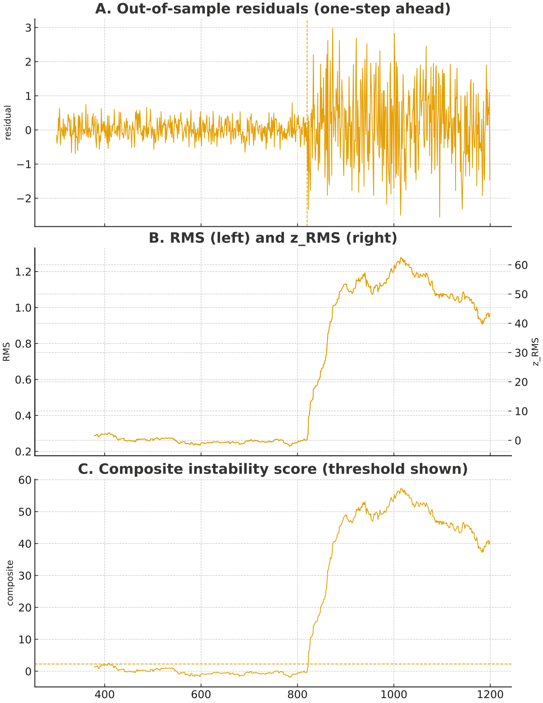
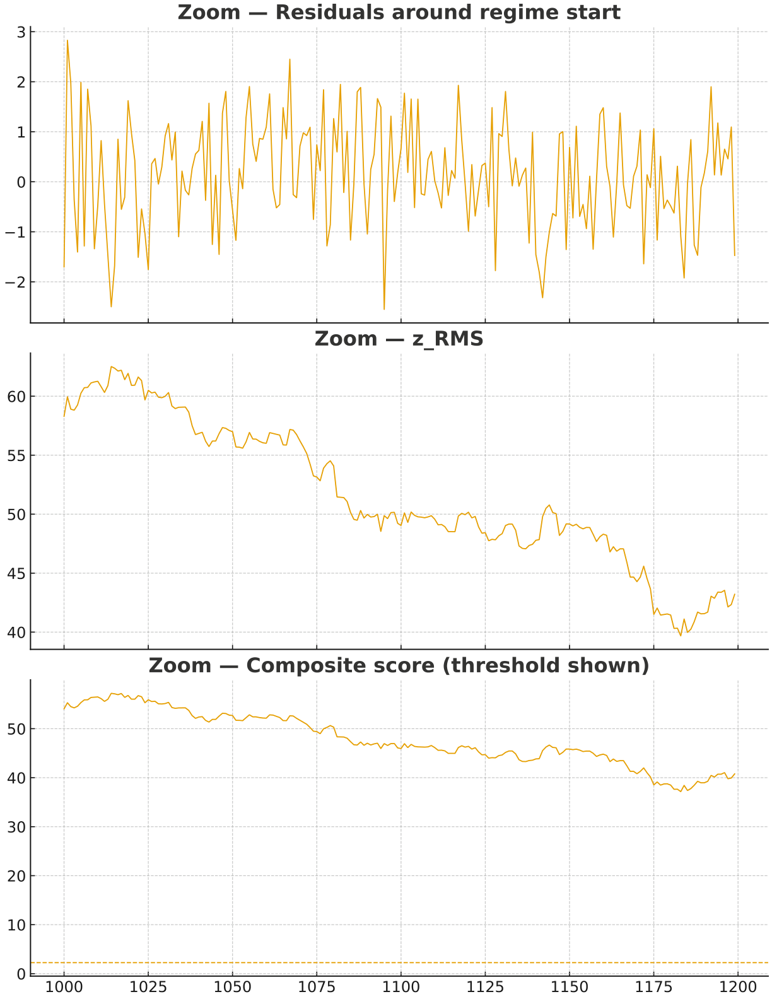

# Residual‑Blowout Filter for Macro Trading (White Letter)

**Goal:** detect when a rolling macro regression **breaks down** (regime shift), so a macro strategy can **pause new trades** until relationships stabilise.

---

## Executive summary

A rolling EUR/USD macro regression can look stable, then fail abruptly during regime shifts.  
The **Residual‑Blowout Filter** monitors *out‑of‑sample residuals* and quantifies:

1) **Magnitude** of errors (RMS of residuals)  
2) **Frequency** of “large” residual events  

Both are normalised via z‑scores and combined into a **composite instability score**.  
When the score exceeds calibrated thresholds, the desk enters a **risk‑off / pause** state for new macro trades.

---

## 1) Model definition (rolling regression)

Estimated on a rolling window:

$$
r^{EUR/USD}_t
= \beta_0 + \beta_1\,DXY_t + \beta_2\,r^{SP500}_t + \beta_3\,VIX_t
+ \beta_4\,(i^{EU}_t - i^{US}_t) + \varepsilon_t
$$

Residual (one‑step / out‑of‑sample):

$$
\hat{\varepsilon}_t = r_t - \hat{r}_t
$$

You monitor \(\hat{\varepsilon}_t\) specifically to detect when the model stops describing reality.

---

## 2) Filter construction

### Step A — Run the rolling regression regularly
At your chosen frequency (e.g., **hourly** or **daily**), store the one‑step residual \(\hat{\varepsilon}_t\).

### Step B — Magnitude: rolling RMS of residuals

$$
RMS_t =
\sqrt{\frac{1}{W}
\sum_{i=t-W+1}^{t} \hat{\varepsilon}_i^2}
$$

### Step C — Frequency: fraction of “large residual” events

Let \(\sigma_\varepsilon\) be a residual scale estimated on a calibration period.  
Define:

$$
F_t =
\frac{1}{W_f}
\sum \mathbf{1} \Big(|\hat{\varepsilon}_i| > k\,\sigma_\varepsilon\Big)
$$

### Step D — Normalise (z‑scores)
Convert \(RMS_t\) and \(F_t\) into z‑scores using a calibration mean and std.

### Step E — Composite instability score

$$
S_t = \alpha\,z^{RMS}_t + (1-\alpha)\,z^{FREQ}_t
$$

---

## 3) Decision rules and thresholds

Two practical trigger policies:

### OR rule (simple)
Pause if:

$$
z^{RMS}_t > z_{thresh} \;\; \text{OR} \;\; F_t > f_{thresh}
$$

### Composite rule (single score)
Pause if:

$$
S_t > s_{thresh}
$$

**Suggested start values:**

- \(z_{thresh} = 2.75\)  
- \(f_{thresh} = 0.12\)  
- \(s_{thresh} = 2.25\)

Calibration balances false alarms vs missed breaks.

---

## 4) Timescale & coefficient stability (how to adapt)

Practical question: *are coefficients stable long enough to estimate/use?*  
A simple method:

1) Start with an estimation timescale aligned to execution (daily/hourly).  
2) Monitor coefficient stability (rolling parameter plots or rolling t‑stats).  
3) If unstable, shorten the window progressively until parameters settle (trade‑off: noise vs slow adaptation).

---

## 5) Simulated example (diagnostics + charts)

The white letter includes a simulated regime‑shift example showing the filter triggering during instability.

### Charts (from the white letter)
**Figure 1 — residuals, RMS/z_RMS, and composite score (threshold shown):**

**Figure 2 — zoomed view around the regime start:**

### Example configuration used in diagnostics

- Regression window: \(W_{reg} = 300\)  
- RMS window: \(W_{rms} = 80\)  
- Frequency window: \(W_{freq} = 80\)  
- Large residual threshold: \(k = 2.0\)  
- Composite weight: \(\alpha = 0.75\)  
- Thresholds: \(z_{thresh}=2.75\), \(f_{thresh}=0.12\), \(s_{thresh}=2.25\)

### Trigger statistics (active sample)

- Active points: **900**  
- OR triggers: **377** (**41.89%**)  
- OR trigger episodes: **1**, avg length **377.0**  
- Composite triggers: **381** (**42.33%**)  
- Composite episodes: **2**, avg length **190.5**  
- Max |residual| observed: **2.978**

---

## 6) Implementation notes & limitations

- Estimation frequency should match execution frequency (hourly/daily).  
- Shorter windows → faster detection but more false positives; longer windows → smoother but slower.  
- Use robust measures if residuals are heavy‑tailed (e.g., MAD).  
- When triggered, prefer **halting new trades** or **reducing size** rather than forced liquidation.

---

## How to discuss this in interviews (short)

> “It’s a regime‑failure detector on a rolling macro regression. I monitor out‑of‑sample residuals, track error magnitude (RMS) and error frequency (tail events), normalise into z‑scores, combine into a single instability score, and gate macro risk when the score breaches calibrated thresholds. I also have a practical procedure for choosing estimation frequency based on coefficient stability.”
